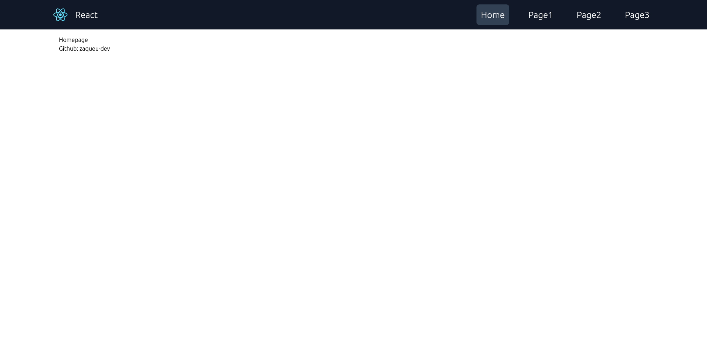
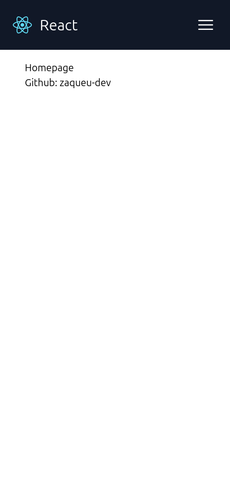
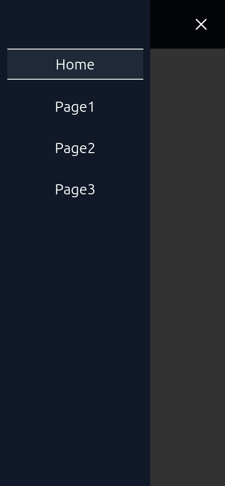

# React Tailwind Template

This is a **default React template** designed to help you kickstart your projects quickly. It includes:

- A **responsive navbar**, fully customizable to fit your needs.
- A **pre-configured Tailwind CSS setup** for rapid styling.
- A default **folder structure** to organize your project efficiently.

## Why Use This Template?

Stop worrying about starting from scratch and dive straight into your ideas! This template is built with simplicity in mind, so you can focus on building your app instead of setting up the basics.

---

## Getting Started

To start using this template, create a new React project with the following command:

```bash
npx create-react-app my-project --template https://github.com/zaqueu-dev/react-tailwind-template
```

## Key features

- **JavaScript Setup**: This template is written in - JavaScript, not TypeScript, to keep it beginner-friendly.
- **Tailwind CSS Integrated**: Pre-configured for easy styling, and you can fully customize it to match your design.
- **Responsive Design**: The included navbar is mobile-friendly and adapts to different screen sizes.
- **Flexible Folder Structure**: A suggested structure for React projects is already in place, but you can adjust it as needed.

## Preview

### Desktop view



### Mobile view




## Customization

Feel free to customize the template to suit your project. Whether you need additional features or a completely different design, this template provides a solid starting point for your ideas.

## Contributing

If you have suggestions or want to contribute to this project, feel free to open a pull request or submit an issue on GitHub.

## License

This project is licensed under the MIT License - see the [LICENSE](./LICENSE) file for details.
